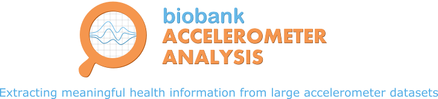

.. accelerometer documentation master file, created by
   sphinx-quickstart on Tue Nov 27 12:48:46 2018.
   You can adapt this file completely to your liking, but it should at least
   contain the root `toctree` directive.

--------------------------------

A tool to extract meaningful health information from large accelerometer datasets. The software generates time-series and summary metrics useful for answering key questions such as how much time is spent in sleep, sedentary behaviour, or doing physical activity.

************
Installation
************
Dependancies include: unix, java 8 (`Java 8 JDK <http://www.oracle.com/technetwork/java/javase/downloads/jdk8-downloads-2133151.html>`_) and python 3.7 (`Anaconda's Python 3 <https://www.anaconda.com/download/>`_ or installation via `Brew <https://docs.python-guide.org/starting/install3/osx/>`_ should do the trick).
::
	$ git clone git@github.com:activityMonitoring/biobankAccelerometerAnalysis.git
        $ bash utilities/downloadDataModels.sh
        $ pip3 install --user .
        $ javac -cp java/JTransforms-3.1-with-dependencies.jar java/*.java

*****
Getting started
*****
To extract a summary of movement (average sample vector magnitude) and
(non)wear time from raw Axivity .CWA (or gzipped .cwa.gz) accelerometer files:
::
	$ python3 accProcess.py data/sample.cwa.gz
        <output written to data/sample-outputSummary.json>
        <time series output written to data/sample-timeSeries.csv.gz>

The main output JSON will look like:
::
	{
            file-name: "sample.cwa.gz",
            file-startTime: "2014-05-07 13:29:50",
            file-endTime: "2014-05-13 09:49:50",
            acc-overall-avg(mg): 33.23,
            wearTime-overall(days): 5.8,
            nonWearTime-overall(days): 0.04,
            quality-goodWearTime: 1
        }

To visualise the time series and activity classification output:
::
  python3 accPlot.py data/sample-timeSeries.csv.gz data/sample-plot.png
    <output plot written to data/sample-plot.png>

.. figure:: samplePlot.png
    
    Output plot of overall activity and class predictions for each 30sec time window

The underlying modules can also be called in custom python scripts:
::
    from accelerometer import summariseEpoch
    summary = {}
    epochData, labels = summariseEpoch.getActivitySummary("sample-epoch.csv.gz", 
            "sample-nonWear.csv.gz", summary)
    # <nonWear file written to "sample-nonWear.csv.gz" and dict "summary" updated
    # with outcomes>

***************
Citing our work
***************
When describing or using the UK Biobank accelerometer dataset, or using this tool
to extract overall activity from your accelerometer data, please cite [Doherty2017]_.

When using this tool to extract sleep duration and physical activity behaviours
from your accelerometer data, please cite [Willetts2018]_ and [Doherty2018]_.

.. [Doherty2017] Doherty A, Jackson D, Hammerla N, et al. (2017) Large scale population assessment of physical activity using wrist worn accelerometers: the UK Biobank study. PLOS ONE. 12(2):e0169649

.. [Willetts2018] Willetts M, Hollowell S, Aslett L, Holmes C, Doherty A. (2018) Statistical machine learning of sleep and physical activity phenotypes from sensor data in 96,220 UK Biobank participants. Scientific Reports. 8(1):7961

.. [Doherty2018] Doherty A, Smith-Bryne K, Ferreira T, et al. (2018) GWAS identifies 14 loci for device-measured physical activity and sleep duration. Nature Communications. 9(1):5257

*******
Licence
*******
This project is released under a `BSD 2-Clause Licence <http://opensource.org/licenses/BSD-2-Clause>`_ (see LICENCE file).

*******
Contributors
*******
Aiden Doherty, Sven Hollowell, Matthew Willetts (University of Oxford)
Dan Jackson, Nils Hammerla (Newcastle University)

.. toctree::
   :maxdepth: 1
   :caption: Contents:

   usage
   methods
   accelerometer

******************
Indices and tables
******************

* :ref:`genindex`
* :ref:`modindex`
* :ref:`search`
