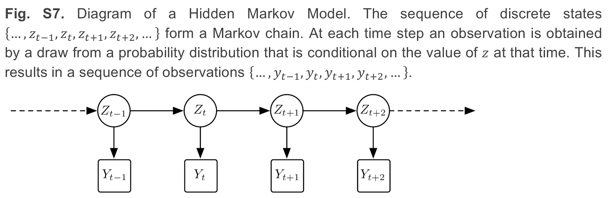
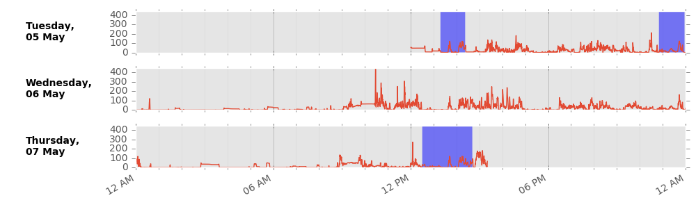

#######
Methods
#######

Interpreted levels of physical activity can vary, as many approaches can be 
taken to extract summary physical activity information from raw accelerometer 
data. To minimise error and bias, our tool uses published methods to calibrate, resample, and summarise the accelerometer data e.g. [Doherty2017]_ [Willetts2018]_ and [Doherty2018]_.

.. figure:: accMethodsOverview.png

    UK Biobank triaxial accelerometer and processing steps to extract physical activity information.
    
    Axivity AX3 triaxial accelerometer worn on dominant hand as used in UK Biobank (top left). Time series trace of processed accelerometer values after one week of wear (top right). Overview of process to extract proxy physical activity information from raw accelerometer data (bottom). 

****************
Data preparation
****************

Calibration
===========
To ensure different devices provide a similar output under similar conditions we calibrate the acceleration signals to local gravity using a procedure initially described by [vanHees2014]_ and run in UK Biobank [Doherty2017]_.

Briefly, we identify stationary periods in ten second windows where all three axes have a standard deviation of less than 13.0 mg. These stationary periods are then used to optimise the gain and offset for each axis (6 parameters) to fit a unit gravity sphere using ordinary least squares linear regression.

Highlight interrupts, and invalid values
========================================
Clipped values, which occur when the sensor’s dynamic range of +-8g is exceeded, are flagged before and after calibration. Recording errors and ‘interrupts’, which could occurr for example if a participant tried to plug their accelerometer device into a computer, are also logged.

Resampling
==========
While the accelerometer is setup to record data at 100Hz, the actual sample rate can fluctuate between 94-104Hz. The implication of this is the introduction of differential effects between individuals when extracting frequency domain features for activity classification. Thus, valid data is resampled to 100 Hz using linear interpolation, except for interrupts lasting longer than 1 second which are set to missing.

***************************
Vector magnitude processing
***************************

Combine x/y/z axes
==================
We compute the sample level Euclidean norm of the acceleration in x/y/z axes.

Gravity and noise removal
=========================
Machine noise is removed using a fourth order Butterworth low pass filter with a cutoff frequency of 20Hz. This filter is applied to the vector magnitude scores, rather than the individual axes, due to more precisely capturing arm rotations. In order to separate out the activity-related component of the acceleration signal, we remove one gravitational unit from the vector magnitude, with remaining negative values truncated to zero. We used this approach in UK Biobank [Doherty2017]_ and it has been validated against doubly labelled water, see [vanHees2011]_ and [White2018]_.

Epoch generation
================
To describe the overall level and distribution of physical activity intensity, we combined the sample level data into five second epochs for summary data analysis, maintaining the average vector magnitude value over the epoch. To represent the distribution of time spent by an individual in different levels of physical activity intensity, we generate an empirical cumulative distribution function from all available epochs.

***************************
Activity classification
***************************

Feature extraction
================
For every non-overlapping 30-second time window (default epoch period our model is trained on), we extracted a 126-dimensional feature vector. These time and frequency domain features includ: vector magniture, it’s mean, standard deviation, coefficient of variation, median, min, max, 25th & 75th percentiles, mean amplitude deviation, mean power deviation, kurtosis & skew, and Fast Fourier Transform (FFT) 1–15 Hz. Features also includ the following in each individual axis of movement: mean, range, standard deviation, covariance, and FFT 1–15 Hz. Roll, pitch, yaw, x/y/z correlations, frequency and power bands are also extracted [Willetts2018]_ [Doherty2018]_

Classification
==============
For activity classification we use a two stage model consisting of balanced random forests and hidden markov models.

Balanced random forests
=======================
Balanced random forests offer a powerful nonparametric discriminative method for multi-activity classification. Predictions of a random forest are an aggregate of individual CART trees (Classification And Regression Trees). CART trees are binary trees consisting of split nodes and terminal leaf nodes. In our case, each tree is constructed from a training set of feature data (just described above) along with ground truth activity classes (free living camera data in [Willetts2018]_ [Doherty2018]_).

There is randomness in the model, as we only give each tree a subset of data and features. This ensures that the trees have low correlation and is necessary as the CART algorithm itself is deterministic. Given the unbalanced nature of our dataset, where some behaviours occur rarely, we use balanced Random Forests to train each tree with a balanced subset of training data. If we have n_rare instances of the rarest class, we pick n_rare samples, with replacement, of data of each of our classes to form our training set for each tree. As each tree is given only a small fraction of data, we make many more trees than in a standard random forest so that the same number of data points are sampled in training as with a standard application of random forests [Willetts2018]_. 

Hidden Markov models
====================
Random forests are able to classify datapoints, but do not have an understanding of our data as having come from a time series. Therefore we use a hidden Markov model (HMM) to encode the temporal structure of the sequence of classes and thus obtain a more accurate sequence of predicted classes. The transition matrix (likelihood of moving from one activity type to another) and emission distribution (likelihood of random forest correctly classifying a given activity type) are empirically calculated. The transition matrix is calculated from the training set sequence of activity states. The calculation of emission probabilities comes from the out of bag class votes of the random forest. Recall that in a random forest each tree is trained on a subset of the training data. Thus by passing through each tree the training data that it was not trained on we get an estimate of the error of the forest. This gives us directly the probability of predicting each class given the true activity class [Willetts2018]_.

With this empirically defined HMM, we can then run the Viterbi algorithm to find the most likely sequence of states given a sequence of observed emissions from the random forest. This smoothing corrects erroneous predictions from the random forest, such as where the error is a blip of one activity surrounded by another and the transitions between those two classes of activity are rare.  

    Diagram of a Hidden Markov Model.

**************************
Physical activity analysis
**************************

Detect non-wear
===============
We remove non-wear time, defined as consecutive stationary episodes lasting for at least 60 minutes. The same standard deviation threshold criteria are applied as described in the calibration procedure to identify stationary episodes from the selected epochs.

Wear-time weighting
===================
We impute non-wear data segments using the average of similar time-of-day vector magnitude and intensity distribution data points with one minute granularity on different days of the measurement. This imputation accounts for potential wear time diurnal bias where, for example, if the device was systematically not worn during sleep in an individual, the crude average vector magnitude during wear time would be a biased overestimate of the true average.

    Example imputation for non-wear (blue shaded) data.

**********************************
Summary physical activity variable
**********************************

Minimum wear time
=================
A physical activity outcome variable is generated by averaging all worn and imputed values. For analysis of UK Biobank accelerometer data, it may be prudent to remove individuals who had less than three days (72 hours) of data or who did not have data in each one-hour period of the 24-hour cycle. We defined these minimum wear time guidelines by performing missing data simulations on 29,765 participants [Doherty2017]_. Using intraclass correlation coefficients, at least 72 hours (3 days) of wear were needed to be within 10% of the true stable seven day measure.

Time series file
================
A .csv time series file is generated for each participant. This provides researchers with a simple way to interrogate the epoch level data for each physical activity outcome variable, without the need for expertise in processing large complex raw data files.

**********
References
**********
.. [Doherty2017] Doherty A, Jackson D, Hammerla N, et al. (2017) Large scale population assessment of physical activity using wrist worn accelerometers: the UK Biobank study. PLOS ONE. 12(2):e0169649

.. [Willetts2018] Willetts M, Hollowell S, Aslett L, Holmes C, Doherty A. (2018) Statistical machine learning of sleep and physical activity phenotypes from sensor data in 96,220 UK Biobank participants. Scientific Reports. 8(1):7961

.. [Doherty2018] Doherty A, Smith-Bryne K, Ferreira T, et al. (2018) GWAS identifies 14 loci for objectively-measured physical activity and sleep duration with causal roles in cardiometabolic disease. Nature Communications. 9(1):5257

.. [vanHees2014] van Hees VT, Fang Z, Langford J, Assah F, Mohammad A, da Silva ICM, et al. Autocalibration of accelerometer data for free-living physical activity assessment using local gravity and temperature: an evaluation on four continents. J Appl Physiol. 2014;117: 738–44. pmid:25103964

.. [vanHees2011] van Hees VT, Renström F, Wright A, Gradmark A, Catt M, Chen KY, et al. Estimation of daily energy expenditure in pregnant and non-pregnant women using a wrist-worn tri-axial accelerometer. PLoS One. 2011;6: e22922. pmid:21829556

.. [White2018] White T, Westgate K, Hollidge S, et al. (2018) Estimating energy expenditure from wrist and thigh accelerometry in free-living adults: a doubly labelled water study. bioRxiv 370247. doi:https://doi.org/10.1101/370247