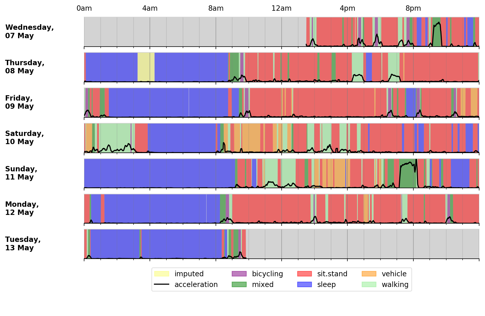

#####
Usage
#####

Our tool uses published methods to extract summary sleep and activity statistics from raw binary accelerometer data files.

***********
Basic usage
***********
To extract a summary of movement (average sample vector magnitude) and
(non)wear time from raw Axivity .CWA accelerometer files:
::
    $ python3 accProcess.py data/sample.cwa.gz
    $ 

    $ <time series output written to data/sample-timeSeries.csv.gz>
    $ <non wear episodes output written to data/sample-nonWearEpisodes.csv.gz>

This may take a few minutes. When done, there will be four files (default in the same folder as the input .cwa file) containing the extracted data.

+--------------------+--------------------------------------------------------+
| File               | Description                                            |
+====================+========================================================+
| OutputSummary.json | Summary statistics for the entire input file, such as  |
|                    | data quality, acceleration and non-wear time grouped   |
|                    | hour of day, and histograms of acceleration levels.    |
|                    | Download a sample file.                                |
+--------------------+--------------------------------------------------------+
| TimeSeries.csv     | Acceleration magnitude for each epoch, and whether the |
|                    | data was imputed or not.                               |
+--------------------+--------------------------------------------------------+
| Epoch.csv          | Acceleration data grouped in epochs (default = 5sec).  |
|                    | Detailed information about XYZ acceleration, standard  |
|                    | deviation, temperature, and data errors can be found   |
|                    | in this file.                                          |
+--------------------+--------------------------------------------------------+
| NonWearBouts.csv   | Start and end times for any non-wear bouts, and the    |
|                    | detected (presumably low) acceleration levels for each |
|                    | bout.                                                  |
+--------------------+--------------------------------------------------------+

To visualise the time output:
::
  $ python3 accPlot.py data/sample-timeSeries.csv.gz data/sample-plot.png
    <output plot written to data/sample-plot.png>

.. figure:: samplePlot.png

    Output plot of overall activity and class predictions for each 30sec time window

*************************
Processing multiple files
*************************

To process multiple files, we recommend the following directory structure be used:
::
    <studyName>/
        files.csv #listing all files in rawData directory
        rawData/ #all raw .cwa .cwa.gz .bin .gt3x files (no spaces in filename)
        summary/ #to store outputSummary.json
        epoch/ #to store feature output for 30sec windows
        timeSeries/ #simple csv time series output (VMag, activity binary predictions)
        nonWear/ #bouts of nonwear episodes
        stationary/ #temp store for features of stationary data for calibration
        clusterLogs/ #to store terminal output for each processed file

This can be created calling our utility script:
::
    $ bash utilities/createStudyDir.sh /myStudy/

Next move relevant raw accelerometer files to the rawData folder:
::
    $ mv *myAccelerometerFiles.cwa /myStudy/rawData/

Then use our python utility function to write processing cmds for all files:
::
    from accelerometer import accUtils
    accUtils.writeStudyAccProcessCmds("/myStudy/", "process-cmds.txt", \
       runName="dec18")
    # <list of processing commands written to "process-cmds.txt">

    # if for some reason we wanted to use different thresholds for moderate
    # and vigorous intensity activities, we could go with
    accUtils.writeStudyAccProcessCmds("/myStudy/", "process-cmds.txt", \
        runName="dec18", cmdOptions="--mgMVPA 90 --mgVPA 435")
    # <list of processing commands written to "process-cmds.txt">

We can then kick-start the processing of all accelerometer files. More advanced
users will probably want to parallelise the below script using their HPC
architecture of choice:
::
    $ bash process-cmds.txt

Next, using our python utility function, we would like to collate all 
individual processed .json summary files into a single large csv for subsequent 
health analses:
::
    from accelerometer import accUtils
    accUtils.collateJSONfilesToSingleCSV("/myStudy/summary/dec18/", \
        "myStudy/dec18-summary-info.csv")
    # 

===============
Quality control
===============
If is often necessary to check that all files have successfully processed. Our
python utility function can write to file all participants' data that was not
successfully processed:
::
    from accelerometer import accUtils
    accUtils.identifyUnprocessedFiles("/myStudy/files.csv", "myStudy/dec18-summary-info.csv", \
          "myStudy/files-unprocessed.csv")
    # <Output CSV listing files to be reprocessed written to "/myStudy/files-unprocessed.csv">

On other occasions some participants' data may not have been calibrated properly.
Our python utility function can assigns the calibration coefs from a previous 
good use of a given device in the same study dataset:
::
    from accelerometer import accUtils
    accUtils.updateCalibrationCoefs("myStudy/dec18-summary-info.csv", \
           "myStudy/files-recalibration.csv")
    # <CSV of files to be reprocessed written to "/myStudy/files-recalibration.csv">

Our python utility function can then re-write processing cmds as follows:
::
    from accelerometer import accUtils
    accUtils.writeStudyAccProcessCmds("/myStudy/", "process-cmds-recalibration.txt", \
       runName="dec18", filesID="files-calibration.csv", cmdOptions="--skipCalibration True")
    # <list of processing commands written to "process-cmds-recalibration.txt">

These 'reprocessed' files can then be processed as outlined in the section above.

************************************
Classifying different activity types
************************************
Different activity classification models can be specified to identify different 
activity types. For example, to use activity states from the Willetts 2018 
Scientific Reports paper:
::
    $ python3 accProcess.py data/sample.cwa.gz \
        --activityModel activityModels/willetts2018.tar

To visualise the time series and new activity classification output:
::
    $ python3 accPlot.py data/sample-timeSeries.csv.gz data/sample-plot.png \
        --activityModel activityModels/willetts2018.tar
    <output plot written to data/sample-plot.png>

    
    Output plot of class predictions using Willetts 2018 classification model. 
    Note different set of activity classes.

========================
Training a bespoke model
========================
It is also possible to train a bespoke activity classification model. This 
requires a labelled dataset (.csv file) and a list of features (.txt file) to 
include from the epoch file.

First we need to evaluate how well the model works on unseen data. We therefore 
train a model on a 'training set' of participants, and then test how well that
model works on a 'test set' of participant. The command below allows us to achieve
this by specifying the test participant IDs (all other IDs will automatically go
to the training set). This will output <participant, time, actual, predicted> 
predictions for each instance of data in the test set to a CSV file to help
assess the model:
::
    import accelerometer
    accelerometer.accClassification.trainClassificationModel( \
        "activityModels/labelled-acc-epochs.csv", \
        featuresTxt="activityModels/features.txt", \ 
        testParticipants="4,5", \ 
        outputPredict="activityModels/test-predictions.csv", \ 
        rfTrees=1000, rfThreads=1) 
    # <Test predictions written to:  activityModels/test-predictions.csv>

A number of `metrics <https://scikit-learn.org/stable/modules/model_evaluation.html#model-evaluation>`_ 
can then be calculated from the test predictions csv file:
::
    import pandas as pd
    import sklearn.metrics as metrics

    # load data
    d = pd.read_csv("test-predictions.csv")
    y_true = d['label']
    y_pred = d['predicted']
    
    # print metrics
    print('kappa = ', metrics.cohen_kappa_score(y_true, y_pred))
    print('accuracy = ', metrics.accuracy_score(y_true, y_pred))
    print(metrics.classification_report(y_true, y_pred))

After evaluating the performance of our model on unseen data, we then re-train 
a final model that includes all possible data. We therefore specify the 
outputModel parameter, and also set testParticipants to 'None' so as to maximise
the amount of training data for the final model. This results in an output .tar model:
::
    import accelerometer
    accelerometer.accClassification.trainClassificationModel( \
        "activityModels/labelled-acc-epochs.csv", \
        featuresTxt="activityModels/features.txt", \
        rfTrees=1000, rfThreads=1, \
        testParticipants=None, \
        outputModel="activityModels/sample-model.tar")
    # <Model saved to activityModels/sample-model.tar>

This new model can be deployed as follows:
::
    $ python3 accProcess.py --activityModel activityModels/sample-model.tar \
        data/sample.cwa.gz

============================
Leave one out classification
============================
To rigorously test a model with training data from <200 participants, leave one
participant out evaluation can be helpful. Building on the above 
examples of training a bespoke model, we use python to create a list of commands
to test the performance of a model trained on unseen data for each participant:
::
    import pandas as pd
    trainingFile = "activityModels/labelled-acc-epochs.csv"
    d = pd.read_csv(trainingFile, usecols=['participant'])
    pts = sorted(d['participant'].unique())

    w = open('training-cmds.txt','w')
    for p in pts:
        cmd = "import accelerometer;"
        cmd += "accelerometer.accClassification.trainClassificationModel("
        cmd += "'" + trainingFile + "', "
        cmd += "featuresTxt='activityModels/features.txt',"
        cmd += "testParticipants='" + str(p) + "',"
        cmd += "outputPredict='activityModels/testPredict-" + str(p) + ".csv',"
        cmd += "rfTrees=1000, rfThreads=1)"
        w.write('python -c $"' + cmd + '"\n')
    w.close() 
    # <list of processing commands written to "training-cmds.txt">

These commands can be executed as follows:
::
    $ bash training-cmds.txt

After processing the train/test commands, the resulting predictions for each 
test participant can be collated as follows:
::
    $ head -1 activityModels/testPredict-1.csv > header.csv
    $ awk 'FNR > 1' activityModels/testPredict-*.csv > tmp.csv
    $ cat header.csv tmp.csv > testPredict-all.csv
    $ rm header.csv
    $ rm tmp.csv

As indicated just above (under 'Training a bespoke model'), a number of metrics 
can be calculated for the 'testPredict-all.csv' file.

**************
Advanced usage
**************
To list all available processing options and their defaults, simply type:
::
    $ python3 accProcess.py -h

Some example usages:

Specify file in another folder (note: use "" for file names with spaces):
::
    $ python3 accProcess.py "/otherPath/other file.cwa" 

Change epoch length to 60 seconds:
::
    $ python3 accProcess.py data/sample.cwa.gz --epochPeriod 60 

Manually set calibration coefficients:
::
    $ python3 accProcess.py data/sample.cwa.gz --skipCalibration True \
        --calOffset -0.2 -0.4 1.5  --calSlope 0.7 0.8 0.7 \
        --calTemperature 0.2 0.2 0.2 --meanTemp 20.2

Extract calibrated and resampled raw data .csv.gz file from raw .cwa file:
::
    $ python3 accProcess.py data/sample.cwa.gz --rawOutput True \
        --activityClassification False

The underlying modules can also be called in custom python scripts:
::
    from accelerometer import summariseEpoch
    summary = {}
    epochData, labels = summariseEpoch.getActivitySummary( \
        "data/sample-epoch.csv.gz", "data/sample-nonWear.csv.gz", summary)
    # <nonWear file written to "data/sample-nonWear.csv.gz" and dict "summary" \
    #    updated with outcomes>
